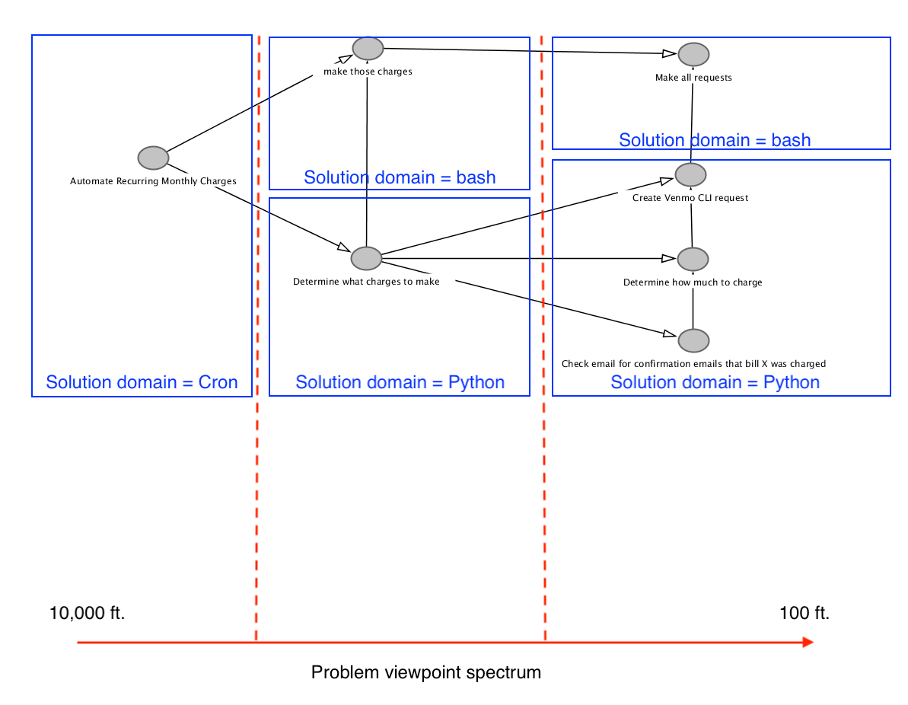

A semi-organized collection of thoughts/musings that occurred as I went through
(and continue to go through) the development process.

# A Balancing Act - Conceptual Ideals and Pragmatic Solutions

In my ideal world, [main.py](main.py) would be written in a way that maps onto
the problem it is trying to solve perfectly - to the point that someone who
doesn't code is able to point to blocks of code and say, "oh, this is easy; this
block does solves this part of the problem, then this block performs the second
part, and then you're done."

To some extent I believe I've achieved this with `run_program.sh`, however 
all the code that is needed to solve the problem (that is written so far) certainly
follows a more "depth-first" approach to problem-solving as opposed to a "breadth-first"
solution. Taken to the extreme (in my opinion), the "breadth-first" would have
all the code in one file; everything that is currently in [Bill.py](Bill.py) would
be put into [main.py](main.py), and what is currently in [main.py](main.py) would
be moved into an `if __name__ == "__main__":` block. Additionaly, one would then
have to decide "Should I even write the actual venmo command to a separate file,
or would it be better to call the command line command from within Python. Then
again, if I'm doing that, any error handling should probably be kept within
Python as well..." and into the reductionist rabbit hole I fall.

This starts to blur the lines a bit and, in my opinion, would become hard to follow.
The below image shows a map of the problem as it is currently structured:



Admittedly, this DAG was created after most of the programming itself was already
complete; a more methodical approach would be to create this map first, with as
much detail as one could, and then start programming from there, making adjustments
as needed.

# Algorithmic Musings

## 1

The first implementation had the following pseudo-structure:

```
# For all monthly bills:
    # find all emails that match the specified string:
        # for all emails that match the specified string:
	    # if the date of the email is later than the last run date:
	        # create the venmo request
```

When this is written out in a more pseudo-code style, using the classes written
for this problem, this becomes:

```
# for bill in bill dictionary:
    # create EmailParser() instance
    # find all emails that match the specified string 

    # for all emails that match the specified string:
	# create Bill() instance
	# if the date of the email is later than the last run date:
	    # create the venmo request
```

However this algorithm isn't the most efficient; since only some of the
emails that match the specified string will be later than the last run date
(call this set of emails M, which is a subset of N, all emails that matched
the specified string), there will be N - M unnecessary `Bill()` instantiations.

By checking if the email date is later than the last run date prior to the `Bill()`
instantiation, this inefficiency is removed:

```
# for bill in bill dictionary:
    # create EmailParser() instance
    # find all emails that match the specified string 

    # for all emails that match the specified string:
    # if the date of the email is later than the last run date:
        # create Bill() instance
        # create the venmo request
```

## 2

There could be a case to be made that once the date of the email is identified,
if that date is prior to the last run date, then no more computation should be
expended on the parsing of that email. In order for this to occur (with the
current framework), the `last_run_date` would have to be passed to the `EmailParser()`
constructor (or the `EmailParser()` instance would have to know about it in
some other manner...).

In my opinion, this starts to "muddy the waters" of one of the design principals
of OOP, *Encapsulation.* Since the ideal is to group **logically related** types,
variables and methods, a variable that isn't related to the concept that the
`EmailParser()` class is made for shouldn't be included in said class.

## 3

A previous iteration had the `venmo_command` being passed into the `Bill` constructor,
and saved as `self.venmo_command`. The `create_venmo_request()` method
was then called upon instantiation, with slighly different syntax, shown below:

```python
    def create_venmo_request(self):

        request_string = f"{self.name} bill - {self.date.strftime('%Y-%m-%d')}"
        venmo_CLI_string = f"{self.venmo_command} charge {self.chargee} {self.amount_to_be_charged} '{request_string}'\n"

        return venmo_CLI_string
```

However, in an effort to keep the code as conceptually close to the problem as
possible, the above was changed to the below:

```python
    def create_venmo_request(self, venmo_command):

        request_string = f"{self.name} bill - {self.date.strftime('%Y-%m-%d')}"
        venmo_CLI_string = f"{venmo_command} charge {self.chargee} {self.amount_to_be_charged} '{request_string}'\n"

        return venmo_CLI_string
```

Since the `venmo_command` isn't actually a part of the concept of a `Bill()`, I
think it makes more sense to remove the `self.venmo_command` attribute from
the constructor, and simply pass it into the `create_venmo_request()` method
when it is called. The `venmo_command`  would more appropriately fall into
the set of concepts that are within "solution domain", whereas the concept of a
Bill is part of the "problem domain," regardless of how the problem is actually
solved.

# Differences when Developing with the Cron as the End Goal

When scheduling a task to run using cron, it is important to keep in mind that
the user's `.bashrc`, `.bash_profile`, etc. will not be loaded, and therefore
absolute paths to command line commands must be used.
